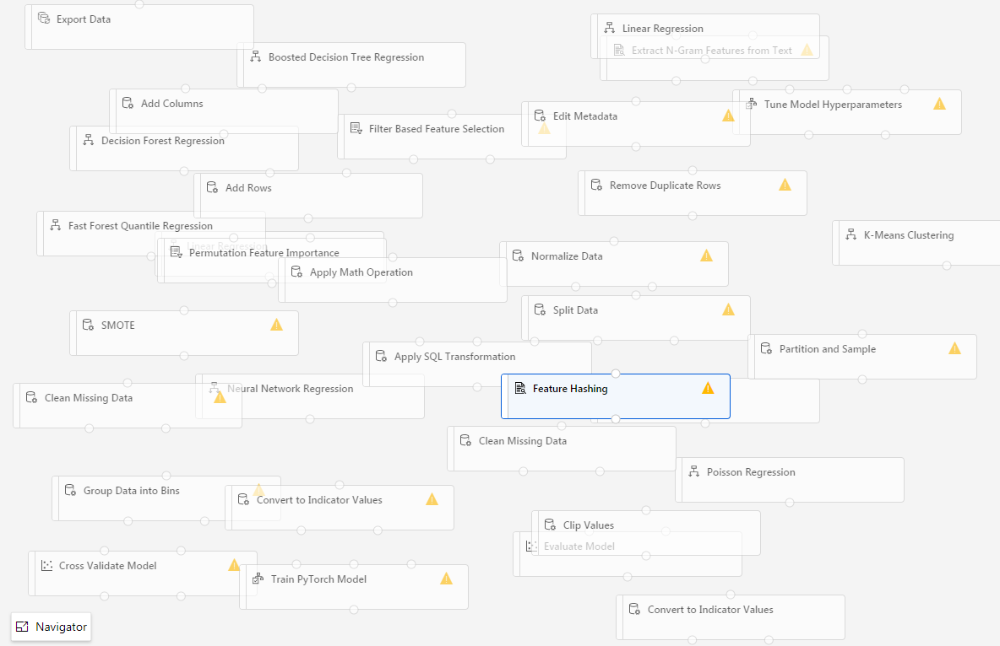
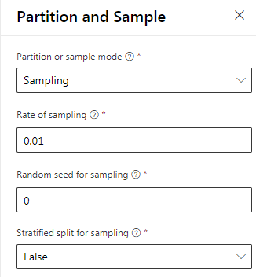
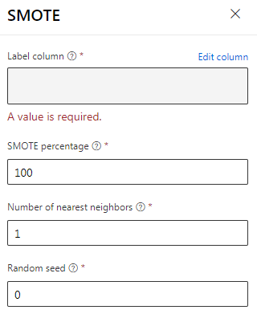
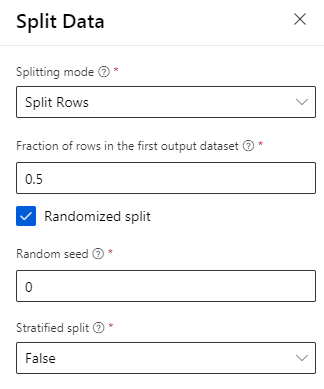
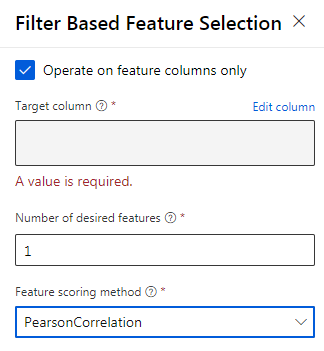
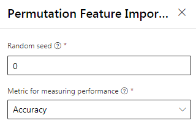
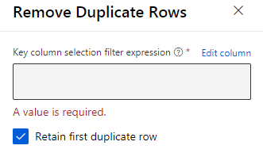
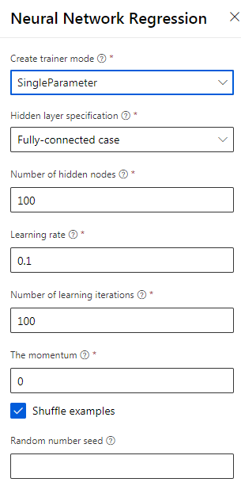
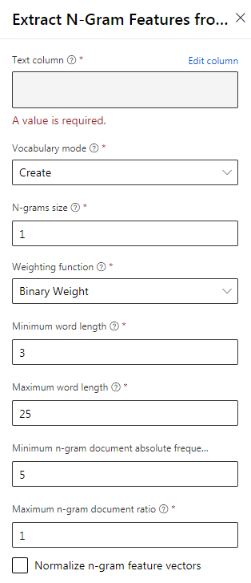
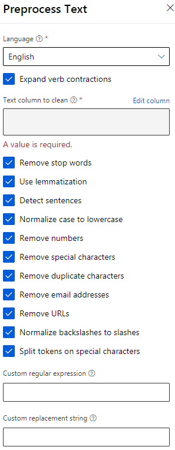

# Important Modules

This notebooks contains some notes on modules from the Azure ML Studio that will most likely be on your DP-100 exam. It is a good idea to familiarize yourself with them.

Please note that this list is of course non-exhaustive. This is just a list of the modules of which I know that there are many practice questions about. 

## Data Transformation

### MICE

For each missing value, this option assigns a new value, which is calculated by using a method described in the statistical literature as "Multivariate Imputation using Chained Equations. With a multiple imputation method, each variable with missing data is modeled conditionally using the other variables in the data before filling in the missing values. In contrast, in a single imputation method (such as replacing a missing value with a column mean) a single pass is made over the data to determine the fill value.

* [Docs (classic)](https://docs.microsoft.com/en-us/azure/machine-learning/studio-module-reference/clean-missing-data)
* [Docs (preview)](https://docs.microsoft.com/en-us/azure/machine-learning/algorithm-module-reference/clean-missing-data)

### Clean Missing Data

https://aka.ms/aml/clean-missing-data

### Edit Metadata

https://aka.ms/aml/edit-metadata

### Parition and Sample

https://aka.ms/aml/partition-and-sample

### SMOTE

https://aka.ms/aml/smote

### Split data

https://aka.ms/aml/split-data

## Feature Selection

### Filter-based feature selection

https://aka.ms/aml/filter-based-feature-selection

### Permutation-based feature selection

https://aka.ms/aml/permutation-feature-importance

## Machine Learning Algorithms

### Linear Regression

https://aka.ms/aml/linear-regression

### Neural Network Regression

https://aka.ms/aml/neural-network-regression

## Model Training

### Tune Model Hyperparameters

https://aka.ms/aml/tune-model-hyperparameters

## Text Analytics

### Extract N-grams from text

https://aka.ms/aml/extract-n-gram-features-from-text

### Preprocess text

https://aka.ms/aml/preprocess-text

## Microsoft Cognitive Toolkit