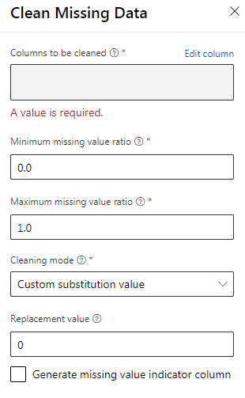
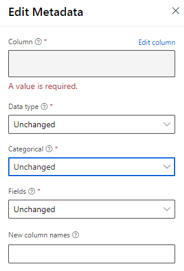

# Important Modules

This notebooks contains some notes on modules from the Azure ML Studio that will most likely be on your DP-100 exam. It is a good idea to familiarize yourself with them.

## Clean and Preprocessing Data

### MICE

For each missing value, this option assigns a new value, which is calculated by using a method described in the statistical literature as "Multivariate Imputation using Chained Equations. With a multiple imputation method, each variable with missing data is modeled conditionally using the other variables in the data before filling in the missing values. In contrast, in a single imputation method (such as replacing a missing value with a column mean) a single pass is made over the data to determine the fill value.

* [Docs (classic)](https://docs.microsoft.com/en-us/azure/machine-learning/studio-module-reference/clean-missing-data)
* [Docs (preview)](https://docs.microsoft.com/en-us/azure/machine-learning/algorithm-module-reference/clean-missing-data)

### Clean Missing Data

* More info here: https://aka.ms/aml/clean-missing-data

### Edit Metadata

* More info here: https://aka.ms/aml/edit-metadata

## Modelling and feature engineering

## Feature Selection Modules

## Microsoft Cognitive Toolkit

