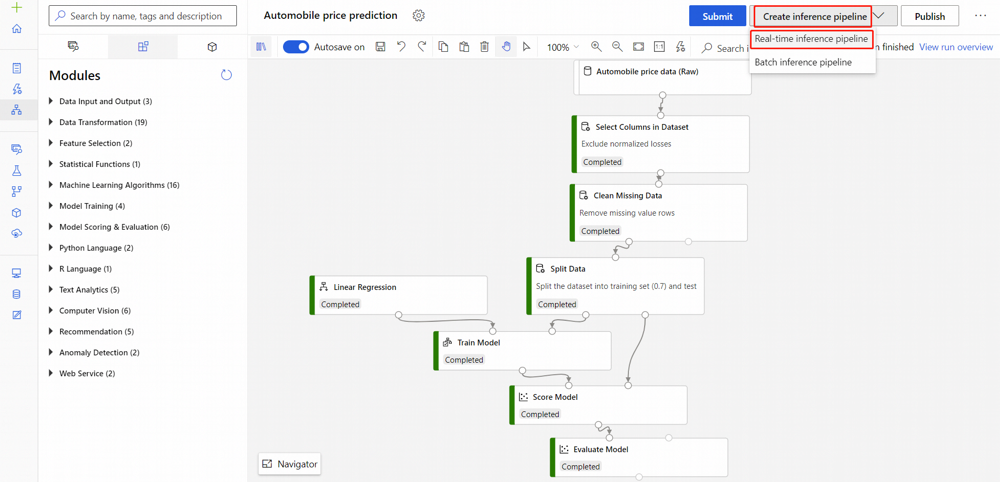

# Azure Data Scientist

This repository contains my notes for preparing the exam [DP-100: Designing and Implementing a Data Science Solution on Azure](https://www.microsoft.com/en-us/learning/exam-dp-100.aspx). If you pass this course you become a **Microsoft Certified Azure Data Scientist Associate**.

The exam consists of roughly 60 questions, 45 of which are Q&A and 15 represent a usecase. You have 3 hours (180 minutes) to answer all the questions. 

Most of the questions in the exam can be broken down into four separate categories:
* Azure ML studio (modules, autoML, designer, etc.)
* Azure Products (Databricks, Data Factory, Virtual machine, etc.)
* Machine learning (PCA, Correlation, metrics, cross-validation, etc.)
* Python (scikit-learn, pandas, etc.)

Here is an overview of the study material I used and recommend.

## Azure ML Studio

Almost every question regarding Azure ML Studio / Azure ML Designer (preview) is about its modules and how to use them. I highly suggest going through the list of modules which can be found [here](https://docs.microsoft.com/en-us/azure/machine-learning/algorithm-module-reference/module-reference) in the Algorithm & Module reference page. 

First thing to do is to explore Azure ML Studio and some of its modules. I recommend following this tutorial on [automobile pricing](https://docs.microsoft.com/en-us/azure/machine-learning/tutorial-designer-automobile-price-deploy), which provides an overview of all the modules and explains how to build and deploy your first machine learning pipeline. 

Note that some modules are **far more important for this exam than others**. In the file `Machine Learning Studio/Relevant_modules.md`you will find a list of modules you **must** be familiar with, as there will be a very high probability that these will be asked in the exam.

For the exam, most of the time you just need to know the module and what it is used for, but for some modules you will get questions on how to configure them and specify its parameters. 

In an ideal world, you should go through the [list](https://docs.microsoft.com/en-us/azure/machine-learning/algorithm-module-reference/module-reference) of modules and understand each and every module's purpose and how to use it, but you do not need all of them for the exam. A solid strategy to move forward is to study dumps of exam questions and to experiment with the modules that you find there. 

## Azure Products

This is basically the trickiest part of the exam. Questions regarding other Azure Products and Services are generally *basic* but you need a good understanding of a lot of different Azure services. There might be questions about Azure Databricks (and Data Factory orchestration), DSVM and DLVM, Azure Notebooks, Azure HDInsight etc. 

The tricky thing is that questions range from "what should you use if you want to run a python notebook without any installation nor Azure subscription" (Azure Notebooks) to "which virtual machine do you need if you want to connect to a PostgreSQL database" (DSVM with Linux) and other super specific questions. 

Again, a solid strategy is to look for exam question dumps and understand experiment with the different services. 

Here are a non-exhaustive list of training recommendations:
- __Azure Fundamentals__:   Some of the knowledge required here can be found in the [AZ-900](https://docs.microsoft.com/en-us/learn/paths/azure-fundamentals/index) Certification. It is advised but not at all mandatory to pass that certification first.
- __Intro to Data Science in Azure__:   Follow the learning path [Explore AI solution development with data science services in Azure](https://docs.microsoft.com/en-us/learn/paths/explore-data-science-tools-in-azure/).
- __Virtual Machines (DSVM/DSLM)__:   Follow the first two modules of the learning path [Get started with Machine Learning with an Azure Data Science Virtual Machine](https://docs.microsoft.com/en-us/learn/paths/get-started-with-azure-dsvm/).
- __Azure Machine Learning Services__:   Follow the first module of the learning path [Build AI solutions with Azure Machine Learning service](https://docs.microsoft.com/en-us/learn/paths/build-ai-solutions-with-azure-ml-service/). 
- __Azure Notebooks__:   Do at least one module in the learning path [Introduction to machine learning with Python and Azure Notebooks](https://docs.microsoft.com/en-us/learn/paths/intro-to-ml-with-python/). They are fun to do and you might learn about Machine Learning, which might help you with questions regarding Machine Learning (cleaning, feature engineering, evaluation etc).
- __Azure Databricks__:   Do at least the first module of the learning path [Extract knowledge and insights from your data with Azure Databricks](https://docs.microsoft.com/en-us/learn/paths/data-science/). The other modules are recommended but not mandatory.

The knowledge of other Azure Products and Services required is quite broad, but not infinite. Here are some more terms that I've come across in questions:

* Azure Cognitive Services
* Azure Data Lake Analytics
* Azure HDInsight with Spark Mlib
* Azure Machine Learning Studio
* Azure Databricks
* Azure Contanier Service
* Azure Storage Explorer
* Azure Blob Storage
* Azure Data Factory
* AzCopy
* Data Science Virtual Machine (DSVM) windows
* Geo-Data Science Virtual Machine (Geo-DSVM) windows
* Deep Learning Virtual Machine (DSVM) linux
* Deep Learning Virtual Machine (DSVM) windows
* PyTorch Caffe2 support
* Microsoft Cognitive toolkit

## Machine Learning & Python

There are some general questions on Machine Learning (PCA, cross-validation, performance metrics, class imbalances, model selection, feature engineering, etc.) but they are in general not very hard. 

In addition to this, there are some questions about Python and sci-kit learn. These questions are, again, not very hard but you need to know some particular syntax which might or might not be tricky. For example, there was a question about the values that are expected as arguments for the scikit-learn PCA function. 

Finally, there are some general questions about PyTorch, TensorFlow, and other machine learning frameworks. Again, a good strategy is to follow some of the machine learning modules and look at some exam dumps. 

## Other resources

* [Alex Nogue's learning repository](https://github.com/alex-nogue/Microsoft_Certification_DP-100_Azure_Data_Scientist)